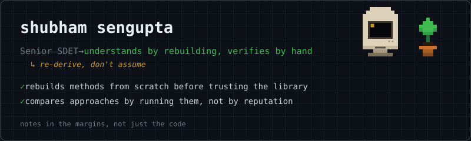

 

I spend my time trying to actually understand how machine learning works — not just call the right library function. That habit comes from six-plus years of being the person whose job was finding out where software quietly lied about working: as a Senior SDET and Technical Business Analyst across Swiss Re, Qualcomm, PwC, and Cognizant. You get suspicious of black boxes in that line of work, and I never quite shook it.

So when I started learning ML, I kept re-deriving instead of trusting. A neural net felt real to me only once I'd written the forward pass and backprop by hand in NumPy — no autograd doing the work I hadn't done myself. Gradient descent felt real only once I'd trained the same network three different ways — full-batch, mini-batch, stochastic — and watched, not assumed, which one actually converged faster, and why.

Underneath that is a longer-running habit — I read philosophy for fun, and the questions that actually keep me up are the ones sitting at the join between the two: whether a system trained to predict the next token can ever be more than that, whether world models are the real path forward instead, what a transition past that ceiling would even look like, and whether anything resembling consciousness could emerge from something built entirely out of probability distributions — or whether that question is malformed from the start. I don't have answers, I'm not sure anyone does — I just find I want to keep pulling on the thread.

Longer-term, I want to be doing research-grade work in this field, not applying pretrained models to problems and calling it a day.

Right now, that means going through the fundamentals this way — one method, rebuilt and verified, at a time — and writing down the reasoning as I go, not just the code.

 

### what's actually here

| folder | what's in it |
|---|---|
| [`ann-numpy-from-scratch/`](https://github.com/senguptashubham/shubhamLearnsMachine) | A full artificial neural net built with just NumPy — forward pass, backprop, and gradients derived and coded by hand, no autograd |
| [`mlp-pytorch-gd-comparison/`](https://github.com/senguptashubham/shubhamLearnsMachine) | One MLP, three ways to train it — full-batch, mini-batch, and stochastic gradient descent — compared on convergence behavior, not assumed |

*(Each folder has its own README with the actual reasoning — what broke, what the math meant, what I'd do differently.)*

 

### stack

**current**

**where I came from**

 

### elsewhere

<!---
senguptashubham/senguptashubham is a ✨ special ✨ repository because its `README.md` (this file) appears on your GitHub profile.
You can click the Preview link to take a look at your changes.
--->
