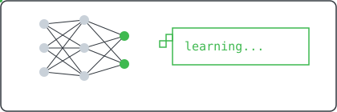

<picture>
  <source media="(prefers-color-scheme: dark)" srcset="./assets/notebook-banner-dark.svg">
  <source media="(prefers-color-scheme: light)" srcset="./assets/notebook-banner-light.svg">
  
</picture>

  

**verifies by hand, not by faith**

 

> I spend my time trying to actually understand how machine learning works — not just call the right library function.

That habit comes from six-plus years of being the person whose job was finding out where software quietly lied about working: as a Senior SDET and Technical Business Analyst across Swiss Re, Qualcomm, PwC, and Cognizant. You get suspicious of black boxes in that line of work, and I never quite shook it.

 

So when I started learning ML, I kept re-deriving instead of trusting. A neural net felt real to me only once I'd written the forward pass and backprop by hand in NumPy — no autograd doing the work I hadn't done myself. Gradient descent felt real only once I'd trained the same network three different ways — full-batch, mini-batch, stochastic — and watched, not assumed, which one actually converged faster, and why.

 

<picture>
  <source media="(prefers-color-scheme: dark)" srcset="./assets/neural-net-learning-dark.svg">
  <source media="(prefers-color-scheme: light)" srcset="./assets/neural-net-learning-light.svg">
  
</picture>

 

Underneath that is a longer-running habit — I read philosophy for fun, and the questions that actually keep me up are the ones sitting at the join between the two: whether a system trained to predict the next token can ever be more than that, whether world models are the real path forward instead, what a transition past that ceiling would even look like, and whether anything resembling consciousness could emerge from something built entirely out of probability distributions — or whether that question is malformed from the start. I don't have answers, I'm not sure anyone does — I just find I want to keep pulling on the thread.

 

Longer-term, I want to be doing research-grade work in this field, not applying pretrained models to problems and calling it a day. Right now, that means going through the fundamentals this way — one method, rebuilt and verified, at a time — and writing down the reasoning as I go, not just the code.

 

<picture>
  <source media="(prefers-color-scheme: dark)" srcset="./assets/lab-flask-testing-dark.svg">
  <source media="(prefers-color-scheme: light)" srcset="./assets/lab-flask-testing-light.svg">
  
</picture>

 

---

 

### what's actually here

The work lives in **[shubhamLearnsMachine](https://github.com/senguptashubham/shubhamLearnsMachine)** — ML fundamentals rebuilt from first principles (so far: neural nets from raw NumPy, gradient descent variants compared head-to-head), each with a README covering the reasoning, not just the code. It grows as I go; check the repo itself for what's current rather than this page.

 

---

 

### stack

**current**

 &nbsp;
 &nbsp;
 &nbsp;
 &nbsp;
 &nbsp;
 &nbsp;
 &nbsp;

**where I came from**

 &nbsp;
 &nbsp;
 &nbsp;
 &nbsp;
 &nbsp;
 &nbsp;
 &nbsp;

 + RestAssured, SpecFlow, TestNG — no icon exists for these anywhere reliable, so left off rather than faked

 

---

 

